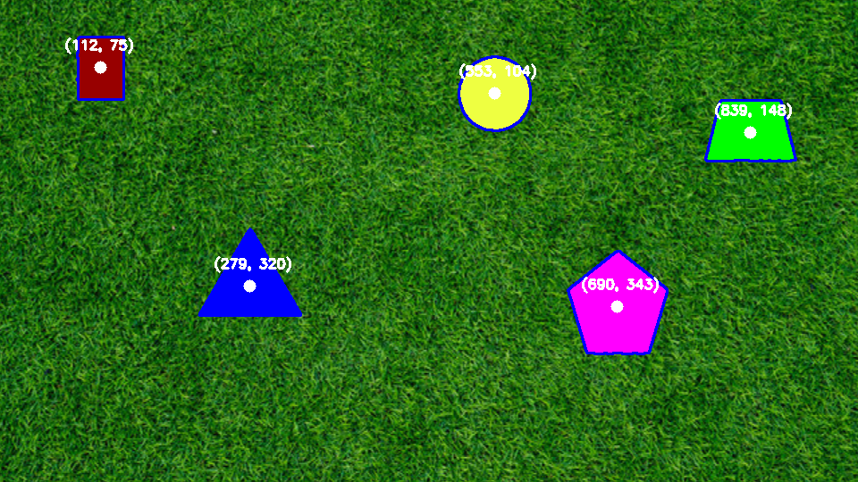

# PennAir 2025 Challenge

Author: Alistair King

## Setup

```bash
conda env create -f environment.yml
conda activate air-challenge
```

## Run

```bash
python main.py --part 1
python main.py --part 2 --save
python main.py --part 3 --save
```

## Static Image Results



The algorithm for static shape detection involves several key steps to robustly identify and outline shapes against a textured background.

1.  **LAB Color Space Conversion**: The image is first converted to the [LAB color space](https://en.wikipedia.org/wiki/CIELAB_color_space), which separates color and lightness information, making color-based segmentation more effective.

2.  **Automatic Background Estimation**: The background color is estimated by sampling the corners of the image and calculating the median color. This provides a robust reference for the background, even with variations in lighting.

3.  **Foreground Masking**: A foreground mask is generated by calculating the color distance of each pixel from the estimated background color. [Otsu's method](https://en.wikipedia.org/wiki/Otsu%27s_method) is then used to automatically threshold this distance map, creating a binary mask of the shapes.

4.  **Mask Refinement**: The binary mask is cleaned up using morphological operations ([closing](https://en.wikipedia.org/wiki/Closing_(morphology)) and [opening](https://en.wikipedia.org/wiki/Opening_(morphology))) and a median blur. This process removes noise, fills holes, and smooths the edges of the detected shapes.

5.  **Contour Analysis**: Contours are detected from the refined mask. Each contour is then filtered based on properties like area, solidity, and contrast to ensure that only valid shapes are retained.

6.  **Center Calculation**: For each valid shape, the center is calculated using image moments. The final output displays the original image with the detected contours and their centers overlaid.


## Video Results

The shape detection algorithm for video builds upon the static image processing pipeline by applying it to each frame of the input video. The core logic for shape identification remains the same, but with adjustments to handle the dynamic nature of video.

1.  **Frame-by-Frame Processing**: The video is read frame by frame. Each frame is treated as an independent image and passed through the shape detection algorithm.

2.  **Dynamic Noise Suppression**: To handle flickering and small, transient artifacts common in video, the contour filtering is made more stringent. A combination of an absolute minimum area and a minimum area as a fraction of the frame size is used. This dual-thresholding approach effectively suppresses small noise while retaining valid shapes across frames.

3.  **Output Generation**: The resulting contours and shape centers are overlaid onto each frame, and the processed frames are re-encoded into an output video. This provides a continuous visual trace of the detected shapes throughout the video.

<!-- <video src="https://drive.google.com/file/d/1WN-VIYOeLxaGmdzOlZXCz1W7t7Cr8Y3O/view" controls>
    Your browser does not support the video tag.
</video> -->

Check out the video [here](https://drive.google.com/file/d/1WN-VIYOeLxaGmdzOlZXCz1W7t7Cr8Y3O/view).

## Background Agnostic Results

Unfortunately, the results are not very good for this part. The algorithm tends to fail to detect the darker parts of the shapes.

<!-- <video src="https://drive.google.com/file/d/1kYhO0CldYyLcx0ZEhKiMdBpjOk9MEBJT/view" controls>
    Your browser does not support the video tag.
</video> -->

Check out the video [here](https://drive.google.com/file/d/1kYhO0CldYyLcx0ZEhKiMdBpjOk9MEBJT/view).